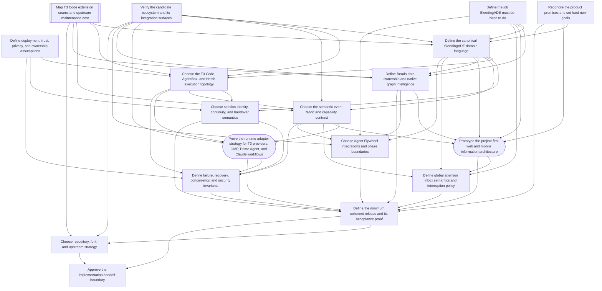

# Wayfinder dependency graph

GitHub issues are the canonical tickets. This file is a readable mirror of their intended dependency structure.

## Initial frontier

- **Define the job BleedingADE must be hired to do** — `grilling`, `HITL`
- **Reconcile the product promises and set hard non-goals** — `grilling`, `HITL`
- **Verify the candidate ecosystem and its integration surfaces** — `research`, `AFK`
- **Map T3 Code extension seams and upstream maintenance cost** — `research`, `AFK`
- **Define deployment, trust, privacy, and ownership assumptions** — `grilling`, `HITL`

Research tickets may be worked in parallel. HITL tickets require Petr and must not be self-resolved.
